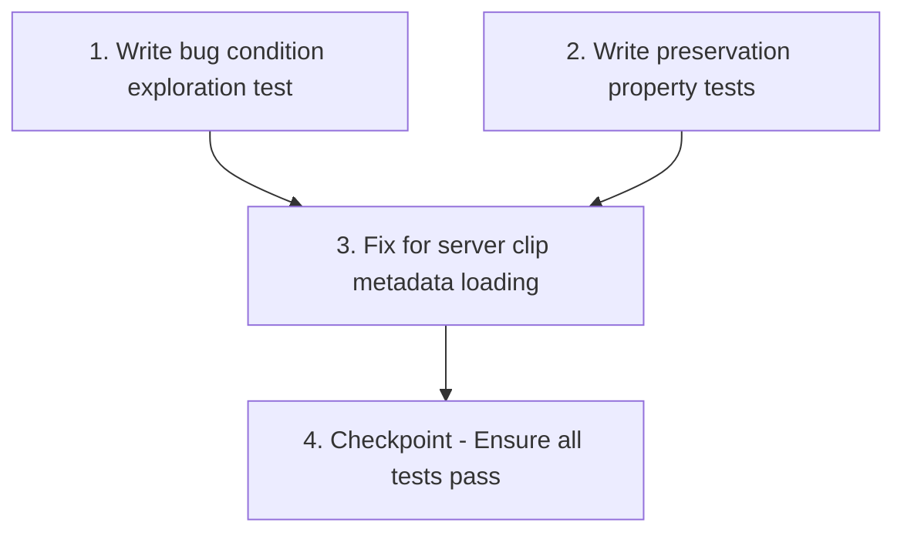

# Implementation Plan

## Overview

This implementation plan follows the bugfix workflow using the bug condition methodology. The tasks are ordered to explore the bug first (write tests that fail on unfixed code), preserve existing behavior (write tests that pass on unfixed code), then implement the fix and verify both sets of tests pass.

## Tasks

- [x] 1. Write bug condition exploration test
  - **Property 1: Bug Condition** - Server Clips Missing from Library
  - **CRITICAL**: This test MUST FAIL on unfixed code - failure confirms the bug exists
  - **DO NOT attempt to fix the test or the code when it fails**
  - **NOTE**: This test encodes the expected behavior - it will validate the fix when it passes after implementation
  - **GOAL**: Surface counterexamples that demonstrate the bug exists
  - **Scoped PBT Approach**: For deterministic bugs, scope the property to the concrete failing case(s) to ensure reproducibility
  - Test implementation: Create a mock server with 5 clips (returned by `/api/assets?kind=clip&limit=50`), ensure local cache directory (`~/.memstroy/cache/clips/`) is empty (no `.txt` or thumbnail files for these clips)
  - Call `reload_library()` on UNFIXED code
  - Assert that server clips appear in `self.library.mellstroy_clips` with `downloaded=false`
  - Assert that metadata files (`.txt` and thumbnails) are created in local cache directory
  - The test assertions should match the Expected Behavior Properties from design:
    - For all clips where `isBugCondition(clip)` is true (clip exists on server but not locally), the clip SHALL appear in the library
    - Each clip SHALL have `downloaded=false`, `server_id` matching the server's clip ID
    - Metadata files SHALL exist locally after `reload_library()` completes
  - Run test on UNFIXED code
  - **EXPECTED OUTCOME**: Test FAILS (this is correct - it proves the bug exists)
  - Document counterexamples found: "Server clips with IDs [X, Y, Z] do not appear in library. Expected 5 clips, found 0."
  - Mark task complete when test is written, run, and failure is documented
  - _Requirements: 2.1, 2.2, 2.3, 2.4_

- [x] 2. Write preservation property tests (BEFORE implementing fix)
  - **Property 2: Preservation** - Local Clips and Existing Workflows Unchanged
  - **IMPORTANT**: Follow observation-first methodology
  - Observe behavior on UNFIXED code for non-buggy inputs (clips that exist locally, manual refresh, lazy download)
  - Write property-based tests capturing observed behavior patterns from Preservation Requirements:
    - **Test 2.1**: Local-only clips (clips with `.mp4` files but no `server_id`) continue to appear in library
      - Create 3 local clips in `~/.memstroy/cache/clips/` with `.mp4`, `.txt`, and thumbnail files
      - Call `reload_library()` on UNFIXED code
      - Observe: All 3 clips appear in library with correct metadata
      - Write property: For all clips where `NOT isBugCondition(clip)` (local clips), they SHALL appear in library with same behavior as before
    - **Test 2.2**: Manual refresh workflow continues to work
      - Trigger `spawn_refresh()` on UNFIXED code
      - Observe: Function calls Telegram ingestion and downloads metadata
      - Write property: Manual refresh SHALL continue to call `spawn_refresh()` without changes
    - **Test 2.3**: Lazy download workflow continues to work
      - Create a server-only clip entry (metadata exists but no `.mp4` file)
      - Simulate dragging clip to canvas on UNFIXED code
      - Observe: `spawn_lazy_download()` is called to download video
      - Write property: Lazy download SHALL continue to work for server-only clips
    - **Test 2.4**: Local cache priority is preserved
      - Create a clip with both local metadata files AND server metadata
      - Call `reload_library()` on UNFIXED code
      - Observe: Local files are used, no server request is made
      - Write property: For clips with local cache, SHALL use local files and NOT fetch from server
  - Property-based testing generates many test cases for stronger guarantees
  - Run tests on UNFIXED code
  - **EXPECTED OUTCOME**: Tests PASS (this confirms baseline behavior to preserve)
  - Mark task complete when tests are written, run, and passing on unfixed code
  - _Requirements: 3.1, 3.2, 3.3, 3.4, 3.5_

- [x] 3. Fix for server clip metadata loading

  - [x] 3.1 Implement the fix in `reload_library()`
    - **File**: `crates/memstroy-gui/src/state.rs`
    - **Function**: `reload_library()`
    - Add server metadata fetch after local filesystem scan completes
    - Check if `server_url` is configured (from app settings)
    - If configured, spawn an async task using existing `tokio::Runtime` handle to fetch clip metadata from `/api/assets?kind=clip&limit=50`
    - For each clip returned by the server:
      - Check if it already exists in local clips list by `server_id` (avoid duplicates)
      - If not, download the description (`.txt` file) to `~/.memstroy/cache/clips/{id}.txt`
      - Download the thumbnail (`.jpg` file) to `~/.memstroy/cache/clips/thumbs/{id}.jpg`
      - Create a `LibraryClip` entry with `downloaded=false` and add to list
    - Send a `JobEvent::RefreshLibraryReloaded` message to trigger UI refresh
    - Implement graceful degradation: if server is unreachable (network error, timeout), log warning and continue with local-only clips (do not block UI or show error messages)
    - _Bug_Condition: isBugCondition(clip) where clip.kind == "clip" AND clip EXISTS on server AND NOT existsLocally(clip.id + ".txt") AND NOT existsLocally(clip.id + ".jpg")_
    - _Expected_Behavior: For all clips where isBugCondition(clip), the clip SHALL appear in library with downloaded=false, server_id set, and metadata files created locally_
    - _Preservation: Local-only clips (3.1), manual refresh (3.2), lazy download (3.4), local cache priority (3.3, 2.5), filesystem change detection (3.5) SHALL remain unchanged_
    - _Requirements: 2.1, 2.2, 2.3, 2.4, 2.5, 3.1, 3.2, 3.3, 3.4, 3.5_

  - [x] 3.2 Verify bug condition exploration test now passes
    - **Property 1: Expected Behavior** - Server Clips Appear in Library
    - **IMPORTANT**: Re-run the SAME test from task 1 - do NOT write a new test
    - The test from task 1 encodes the expected behavior
    - When this test passes, it confirms the expected behavior is satisfied
    - Run bug condition exploration test from step 1
    - **EXPECTED OUTCOME**: Test PASSES (confirms bug is fixed)
    - Verify that server clips now appear in library with `downloaded=false`
    - Verify that metadata files (`.txt` and thumbnails) are created in local cache
    - _Requirements: 2.1, 2.2, 2.3, 2.4_

  - [x] 3.3 Verify preservation tests still pass
    - **Property 2: Preservation** - Local Clips and Existing Workflows Unchanged
    - **IMPORTANT**: Re-run the SAME tests from task 2 - do NOT write new tests
    - Run preservation property tests from step 2
    - **EXPECTED OUTCOME**: Tests PASS (confirms no regressions)
    - Confirm all preservation tests still pass after fix:
      - Local-only clips continue to appear in library
      - Manual refresh continues to work
      - Lazy download continues to work
      - Local cache priority is preserved
    - _Requirements: 3.1, 3.2, 3.3, 3.4, 3.5_

- [x] 4. Checkpoint - Ensure all tests pass
  - Run all tests (bug condition + preservation)
  - Verify no regressions in existing functionality
  - Test graceful degradation: disconnect server and verify app still loads local clips
  - Test pagination: verify only first 50 clips are fetched initially (future enhancement: implement scroll-based pagination)
  - Ensure all tests pass, ask the user if questions arise.

## Task Dependency Graph



```json
{
  "waves": [
    {
      "name": "Exploration",
      "tasks": ["1"]
    },
    {
      "name": "Preservation",
      "tasks": ["2"]
    },
    {
      "name": "Implementation",
      "tasks": ["3"]
    },
    {
      "name": "Validation",
      "tasks": ["4"]
    }
  ]
}
```

## Notes

- Task 1 (Bug Condition Exploration Test) MUST be written and run BEFORE implementing the fix. The test is expected to FAIL on unfixed code, confirming the bug exists.
- Task 2 (Preservation Property Tests) MUST be written and run BEFORE implementing the fix. These tests are expected to PASS on unfixed code, establishing the baseline behavior to preserve.
- Task 3.1 implements the fix by modifying `reload_library()` in `crates/memstroy-gui/src/state.rs` to fetch clip metadata from the server.
- Task 3.2 re-runs the bug condition test from Task 1 (same test, not a new one) and expects it to PASS, confirming the bug is fixed.
- Task 3.3 re-runs the preservation tests from Task 2 (same tests, not new ones) and expects them to still PASS, confirming no regressions.
- The fix uses the existing async job infrastructure to avoid blocking the UI during server requests.
- Graceful degradation is built-in: if the server is unreachable, the app continues to work with local-only clips.
